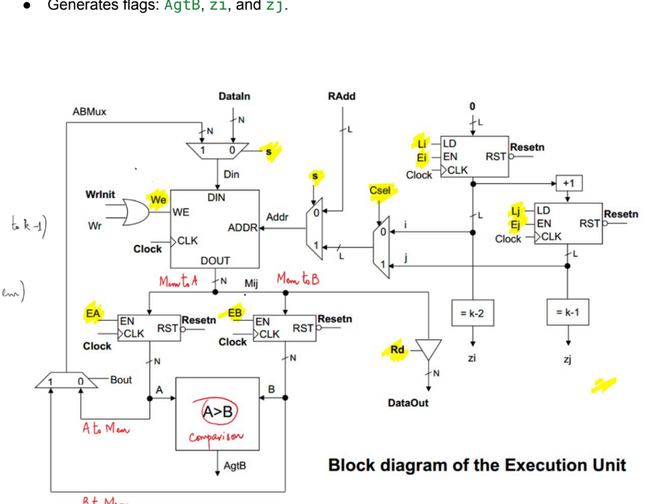
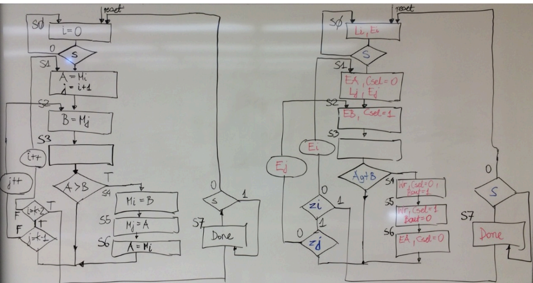
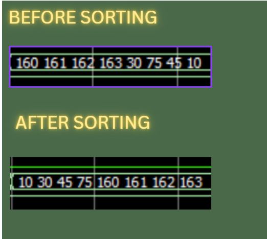

# SORTING_VERILOG-_HARDWARE

# 📘 Verilog Sorting Module (Modified Selection Sort)

This project implements a hardware-based sorting algorithm using Verilog HDL. It mimics a modified **selection sort**, where elements from RAM are compared and swapped under FSM control. Ideal for FPGA, simulation, or educational labs.

---

## 📌 Features

- ✅ Finite State Machine (FSM) based controller
- ✅ Uses modular components: counters, registers, RAM, comparator
- ✅ Swaps elements in-place during sorting
- ✅ Ready/Done handshake using `s` and `done`
- ✅ Read/write support to external RAM

---

## 🏗️ Architecture Overview

> Components include:
> - Two `regcounter` modules (`i`, `j`)
> - RAM module with external/internal access
> - Two 8-bit registers for data comparison
> - A comparator module
> - FSM that orchestrates control flow

---

## 🔄 FSM Workflow

### States:
- **000**: Idle — Wait for `s = 1`
- **001–011**: Load and compare M[i], M[j]
- **100–101**: Swap values if `A > B`
- **110**: Update counters (`j`, then `i`)
- **111**: Sorting `done`; wait for `s = 0` to restart

---

## 📊 Simulation Example

This waveform shows:
- The `done` signal going high after sorting completes
- FSM transitions across states
- Memory values being updated via internal data path

---

## 🔧 Inputs & Outputs

### Inputs

| Signal   | Width | Description                        |
|----------|-------|------------------------------------|
| `clk`    | 1     | Clock                              |
| `rstn`   | 1     | Active-low Reset                   |
| `s`      | 1     | Start Sorting Signal               |
| `wrin`   | 1     | External Write Enable to RAM       |
| `rd`     | 1     | External Read Enable from RAM      |
| `datain` | 8     | Data to write into RAM             |
| `Radd`   | 3     | Address for external RAM access    |

### Outputs

| Signal   | Width | Description                        |
|----------|-------|------------------------------------|
| `done`   | 1     | High when sorting completes        |
| `DOUT`   | 8     | Data read from RAM (when `rd`=1)   |

---

## 🧪 How to Use

1. Reset the system with `rstn = 0 → 1`
2. Load unsorted data into RAM using:
   - `wrin = 1`
   - Provide `Radd` and `datain`
3. Set `s = 1` to start sorting
4. Wait for `done = 1`
5. Set `rd = 1` to read sorted data from RAM using `Radd`

---

## 📁 Files

- `top.v`: Main sorting module
- `RAM.v`, `regcounter.v`, `register.v`, `comparator.v`, `checka.v`, `checkb.v`: Supporting modules
- `tb_top.v`: Testbench for simulation
- `fsm_diagram.png`, `block_diagram.png`, `simulation_waveform.png`: Visual references

---

## 📬 Contact

For questions or modifications, feel free to reach out or contribute!

---

